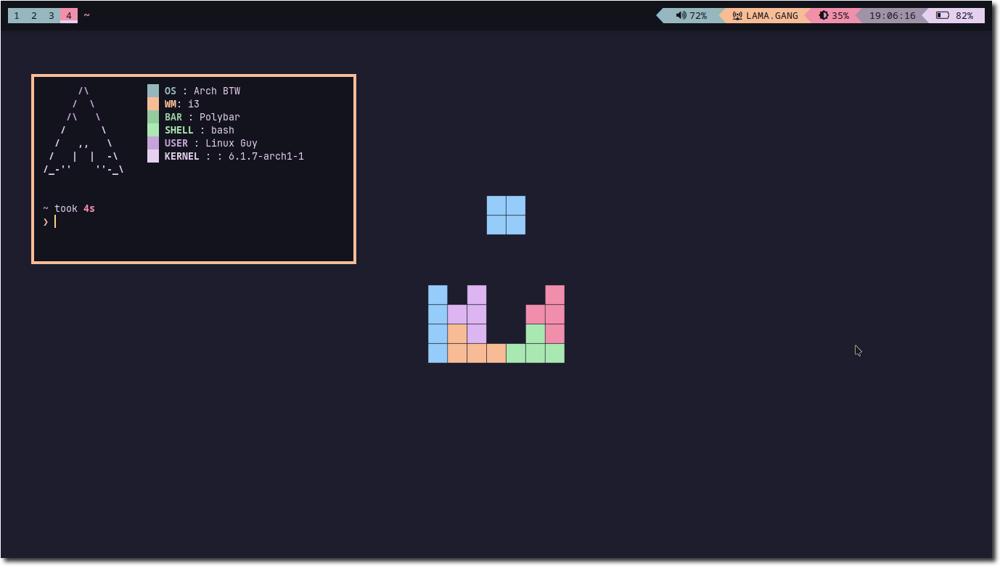
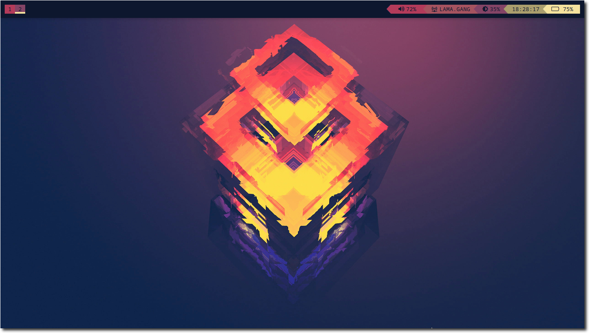
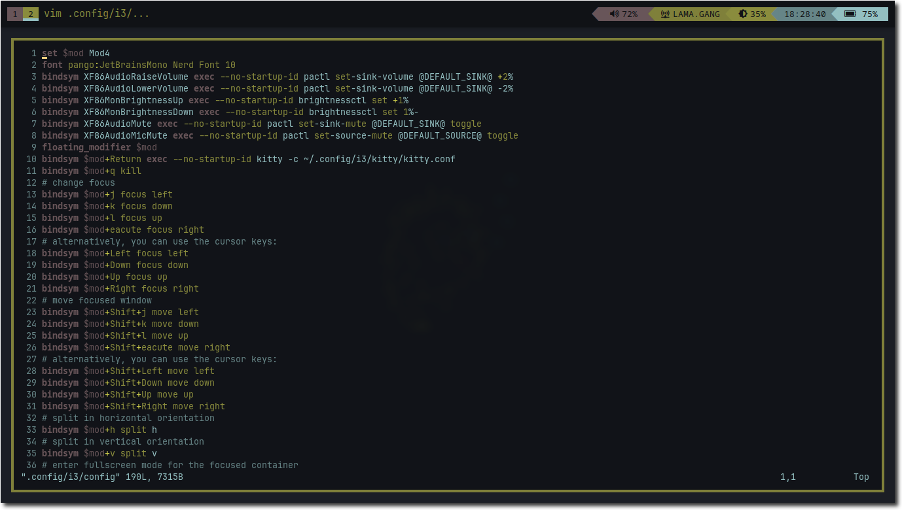
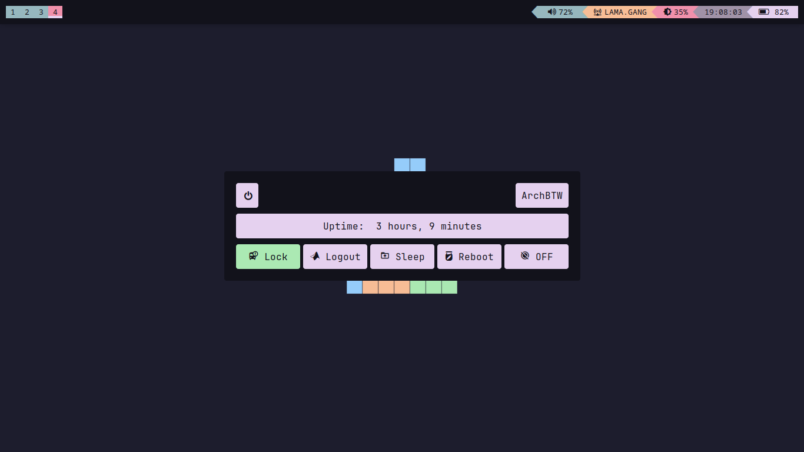
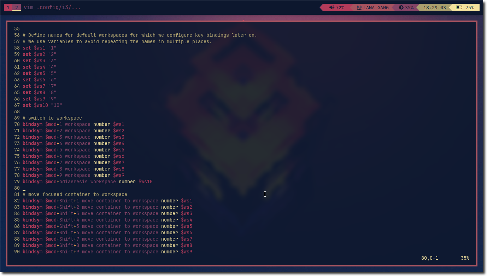
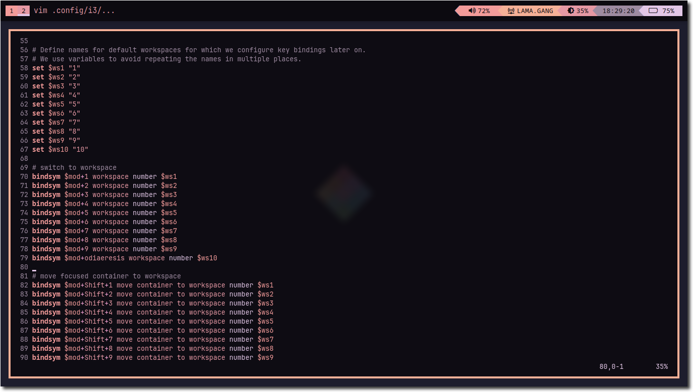
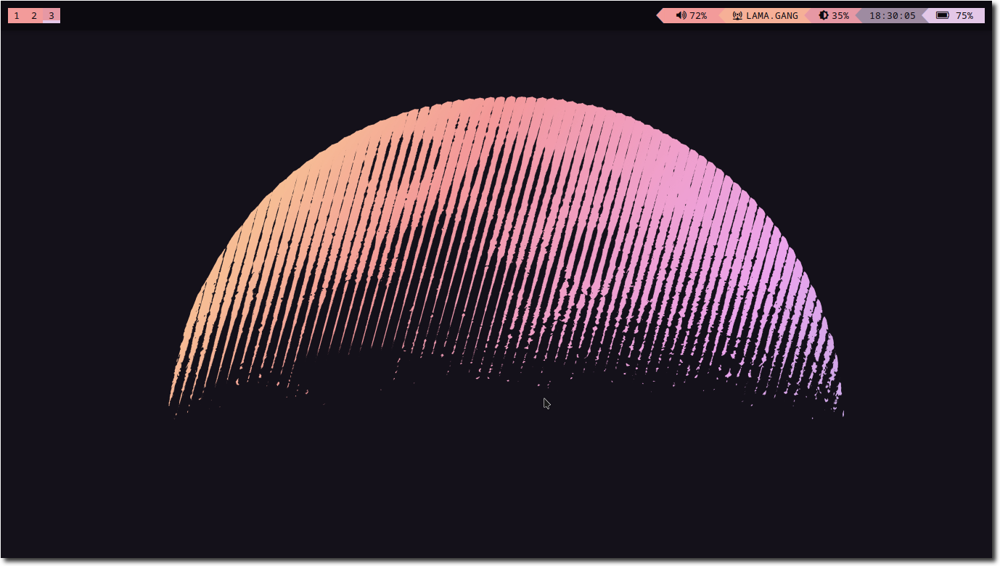

<p align="center">
  <b> ~ i3 Wm's configuration files ~ </b>
</p>

<!-- shields -->

<p align="center">
  
  </br>
  
  
  </br>
  
  
  
  </br>
  
  
  
</p>

<!-- shields -->

<p align="center">
  <b> ~ Workflow Showcase On Youtube ~ </b>
</p>

<p align="center">
  <a href="https://www.youtube.com/watch?v=reBTqKR8SM4" target="_blank" >
    
   
  </a>
</p>


[](https://hits.seeyoufarm.com)

### APPS [ Make sure u have installed this ]

```
* WM : i3
* Terminal : kitty 
* Application launcher : Rofi 
* Bar : polybar
* Compositor : Picom 
* Notification : dunst 
* Screenshot : import -> imagemagick
* Volume Control : pavucontrol 
* Policy kit Authentication : polkit-gnome 
* Wallpaper Utility : feh 
* File Manager : pcmanfm
* Screen Locker : i3lock-fancy
* Browser : qutebrowser -> As my choice you can use your own choice 
* colorscheme generator : pywal -> colorscheme generator using wallpaper
```
### [ Dependencies Installation ] 
```
* sudo pacman -S polybar i3-wm rofi kitty brightnessctl nmtui dunst imagemagick pavucontrol feh pcmanfm qutebrowser python-pywal ttf-jetbrains-mono-nerd cantarell-fonts ttf-meslo-nerd noto-fonts materia-gtk-theme gtk-engines gtk-engine-murrine lxappearance
* paru -S i3lock-fancy python-pywalfox wal-telegram-git tela-circle-icon-theme-purple
```

### [ Installation ]
```

* git clone https://github.com/LinuxNerdBTW/i3-MINI.git && cd i3-MINI
* cp -rv config/* ~/.config/
* cp -rv local/share/* ~/.local/share/
```
### [ Theeming ] 
* Use Lxappearance For Changing Desktop Icons and Application Themes - Gtk Applications 
### [ Launching ] 
* Add This Line To Your ~/.xinitrc file

```
i3_run() {
  wal -R
  exec i3
}

session=$1

case $session in
    i3 	) i3_run;;
esac

```
* Now You can Simply use startx ~/.xinitrc i3
* You can also make alias for this if u want to make it simple .
---
# [ ScreenShoots ] 

### Simple and Elegent look 



### With Pywal Integreted




> **_NOTE:_** Vim , Qutebrowser, firefox, telegram + Pywal colorscheme

### Application Launcher - Pywal integrated


### PowerMenu - Pywal Integrated



### Some More








---

### KeyBindings 

```
* Super + D - AppLauncher
* Super + Return - Terminal
* Super + 1,2,3,4.... - workspace Switch
* CTRL + ALT + LEFT,RIGHT - workspace Next,Previous
* Super + V - Vertical Split
* Super + H - Horizontal Split 
* Super + b - Launch Qutebrowser 
* Super + m - Music Controller 

********************Explore********************

NOTE: Check ~/.config/i3/config - Further Keybindings

```


> **_NOTE:_** All the dependencies and Fonts needs to be properly installed otherwise may not work properly 


